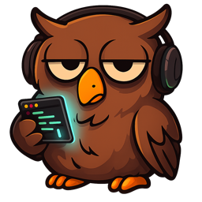
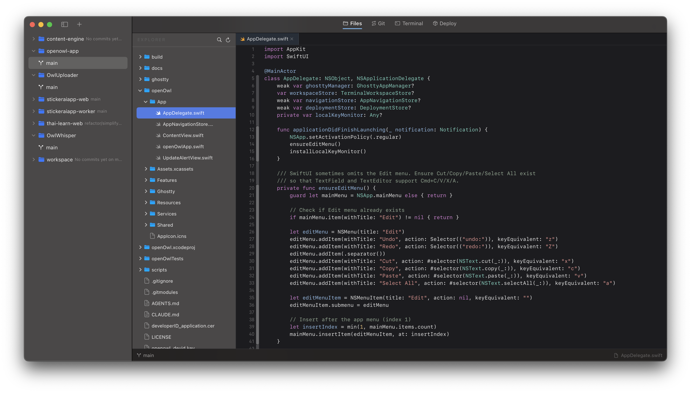
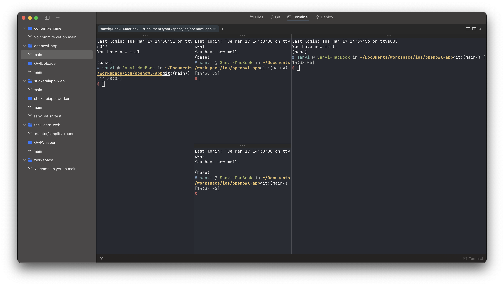
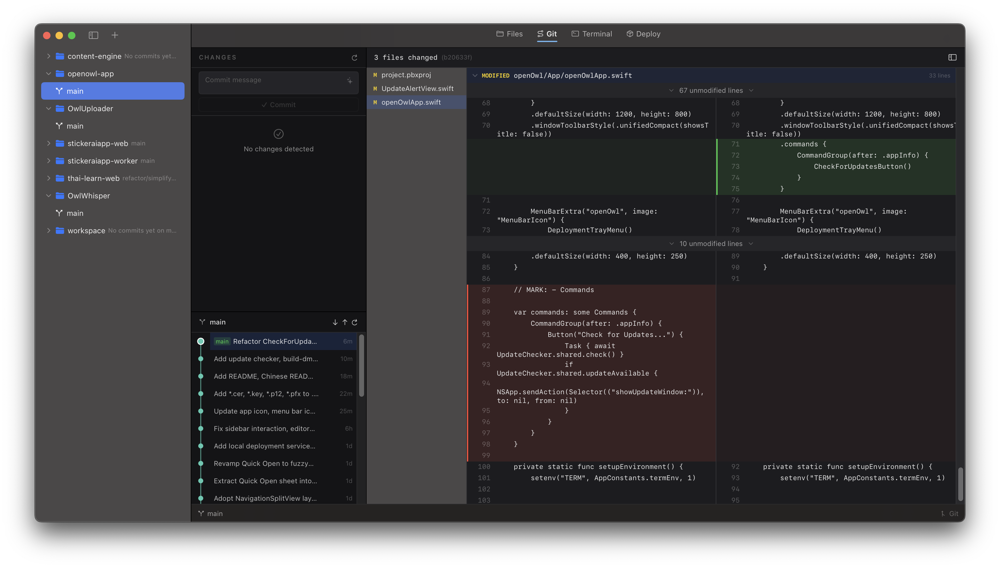
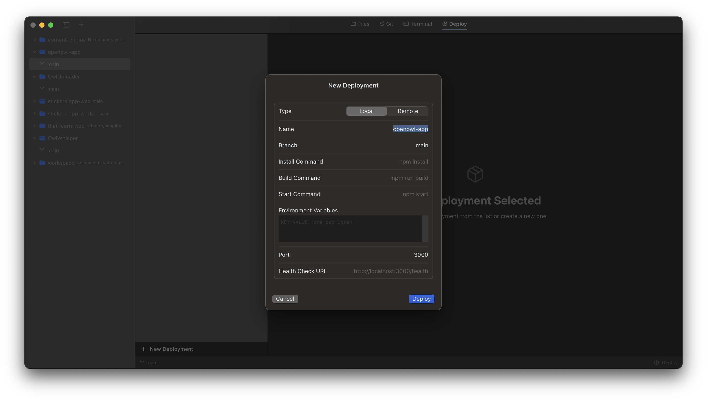

<p align="center">
  
</p>

<h1 align="center">OpenOwl</h1>

<p align="center">
  <strong>macOS native Git GUI + Terminal desktop app</strong><br>
  Built with Swift, <a href="https://github.com/ghostty-org/ghostty">libghostty</a>, and Metal GPU rendering
</p>

<p align="center">
  <a href="#features">Features</a> &bull;
  <a href="#installation">Installation</a> &bull;
  <a href="#building">Building</a> &bull;
  <a href="#architecture">Architecture</a> &bull;
  <a href="README_CN.md">中文文档</a>
</p>

---

## What is OpenOwl?

OpenOwl is a macOS-native desktop app that combines a **GPU-accelerated terminal** with a **Git GUI** and **file editor** in one window. No built-in AI — the terminal is open for you to use any CLI tool you want.

## Features

- **Terminal** — Powered by [libghostty](https://github.com/ghostty-org/ghostty) with Metal GPU rendering. Tabs, split panes, drag-to-reorder. In-pane search (Cmd+F) with match navigation.
- **Git Changes** — Stage, unstage, discard files. Side-by-side diff view. Commit with message. Branch tracking.
- **File Explorer** — NSOutlineView file tree with git status badges. Multi-tab code editor with syntax highlighting (tree-sitter). Quick Open (Cmd+P) with fuzzy search.
- **Project Sidebar** — Multi-project support. Git worktree management (create, archive, rename). Per-project terminal isolation. Claude API status monitoring.
- **Local Deployment** — Clone, build, and start services locally. Health check monitoring. System tray status.
- **Settings (Cmd+,)** — Appearance mode (System / Light / Dark). Terminal theme picker with 463 built-in color schemes. Config stored in `~/Library/Application Support/com.openowl.app/config` (ghostty-compatible format).
- **Menu Bar Shortcuts** — All keyboard shortcuts listed in the macOS menu bar for discoverability.

## Screenshots

### File Explorer & Code Editor
Multi-tab editor with tree-sitter syntax highlighting, file tree with git status badges, and Quick Open (⌘P).



### Terminal
GPU-accelerated terminal powered by libghostty. Tabs, split panes, drag-to-reorder.



### Git Changes
Stage, unstage, discard files. Side-by-side diff view with commit history graph.



### Local Deployment
Clone, build, and start services locally with health check monitoring.



## Installation

### Requirements

- macOS 14.0 (Sonoma) or later
- Apple Silicon or Intel Mac

### Download

Download the latest `.dmg` from [GitHub Releases](https://github.com/sanvibyfish/openowl-app/releases).

## Building

### Prerequisites

- Xcode 15.0+
- [XcodeGen](https://github.com/yonaskolb/XcodeGen) (`brew install xcodegen`)
- [libghostty](https://github.com/ghostty-org/ghostty) — follow the [integration guide](docs/features/001-libghostty-integration.md)

### Steps

```bash
# Clone the repository
git clone https://github.com/sanvibyfish/openowl-app.git
cd openowl-app

# Generate Xcode project
xcodegen generate

# Open in Xcode and run
open openOwl.xcodeproj
# Cmd+R to build and run
```

### Build from command line

```bash
xcodebuild -scheme openOwl -configuration Debug build
```

## Architecture

```
openOwl/
├── App/                    # SwiftUI App entry point
├── Features/
│   ├── Terminal/           # libghostty terminal (tabs, splits, drag)
│   ├── Git/                # Git changes panel, diff view
│   ├── FileExplorer/       # File tree, multi-tab editor, Quick Open
│   ├── Deployment/         # Local deployment service
│   └── Sidebar/            # Project list, worktree management
├── Services/
│   ├── GitService.swift    # git CLI wrapper
│   └── FileWatcher.swift   # File system monitoring
├── Ghostty/                # libghostty Swift wrapper
│   ├── GhosttyApp.swift    # ghostty_app_t lifecycle
│   ├── GhosttyTerminal.swift # ghostty_surface_t + Metal rendering
│   └── GhosttyConfig.swift # Configuration
└── Shared/                 # Theme, constants, utilities
```

### Tech Stack

| Component | Technology |
|-----------|-----------|
| Language | Swift |
| UI | SwiftUI + AppKit (hybrid) |
| Terminal | libghostty (Zig, Metal GPU rendering) |
| Editor | [CodeEditSourceEditor](https://github.com/CodeEditApp/CodeEditSourceEditor) (tree-sitter) |
| Git | Process-based git CLI |
| File system | FileManager + DispatchSource |
| Build | Xcode + SPM + XcodeGen |

## Contributing

Contributions are welcome! Please read the existing code and follow the project conventions.

1. Fork the repository
2. Create a feature branch (`git checkout -b feature/amazing-feature`)
3. Commit your changes
4. Push to the branch (`git push origin feature/amazing-feature`)
5. Open a Pull Request

## License

This project is licensed under the GNU General Public License v3.0 — see the [LICENSE](LICENSE) file for details.

## Acknowledgments

- [Ghostty](https://github.com/ghostty-org/ghostty) — The terminal emulator library
- [CodeEditApp](https://github.com/CodeEditApp) — Source editor components
- [cmux](https://github.com/manaflow-ai/cmux) — libghostty integration reference
